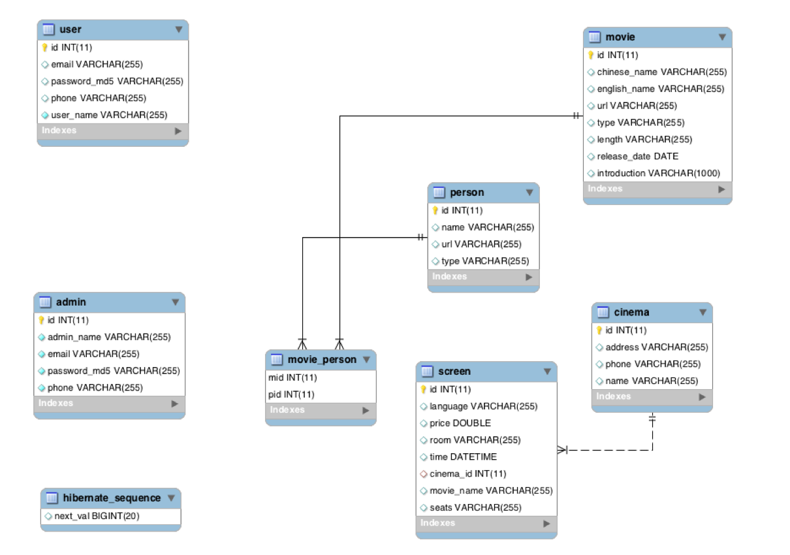

# DatabaseServer

Database server of ticket system.

It does not expose 3306 port but using "docker link" to connect with RESTful backend server.

## Installation

* Requirements

  * docker

* Build docker image

  ```shell
  $ docker build -t db-server .
  ```

* Run docker container

  ```shell
  $ docker run -d --name db db-server
  ```

* need to stop web-service server container before building and build after building

  ```shell
  docker rm restful-server
  docker rmi kinpzz/restful-server
  docker build -t kinpzz/restful-server ../WebService
  docker run -d -p 127.0.0.1:8082:8082 --name restful-server --link db:db-server kinpzz/restful-server
  ```

## Model



* user 表：用户表，记录用户的信息，用户名，密码的 MD5，电话，邮箱
* movie 表：记录电影的信息，包括中文名，英文名，电影类型，电影时长，上映日期，电影简介， 电影海报的 URL，参演人员名单
* person 表：记录电影人的信息，通过 type 列区别是导演还是演员，包括名字，照片 URL，type 电 影人的类型（导演/演员）
* cinema 表：订单编号，电影 id、影院 id、场次 id、座位 id screen 表：荧屏 id，语言，价格，房间 id，时间，影院 id，电影名字，座位 id 
* admin 表：id，名字，密码，email，电话号码

movie 表和 person 表是一对多的关联映射关系

# Reference

https://github.com/AwesomeTickets/DatabaseServer